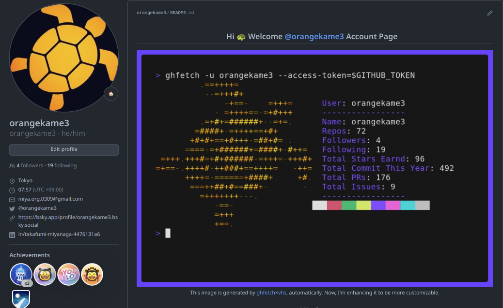

<div align="center">
  
# ghfetch

:octocat: ghfetch is a CLI tool to fetch GitHub user information and show like neofetch
  
<a href="https://opensource.org/licenses/MIT">

</a>
<a href="https://pkg.go.dev/github.com/orangekame3/stree">

</a>
<a href="https://github.com/orangekame3/ghfetch/actions/workflows/tagpr.yml">

</a>
</div>

## Demo

<p align="center">

</p>

## Install

### Go

```shell
go install github.com/orangekame3/ghfetch@latest
```

### Homebrew

```shell
brew install orangekame3/tap/ghfetch
```

### Manual Download

Download the latest compiled binaries and put it anywhere in your executable path.

[Download here](https://github.com/orangekame3/ghfetch/releases)

## Quick Start

```shell
ghfetch -u <your_github_account_name> --access-token=<YOUR_GITHUB_PERSONAL_ACCESS_TOKEN>
```

## Usage

```shell
❯ ghfetch -h
Fetch GitHub user's profile, just like neofetch

Usage:
  ghfetch [flags]

Flags:
      --access-token string   Your GitHub access token
  -c, --color string          Highlight color red, green, yellow, blue, magenta, cyan (default "blue")
  -h, --help                  help for ghfetch
  -u, --user string           GitHub username
  -v, --version               version for ghfetch
```

## Obtaining a GitHub Personal Access Token

ghfetch requires a GitHub personal access token to fetch user information. You can create a personal access token by following the instructions on the GitHub documentation:

[Managing your personal access tokens](https://docs.github.com/en/authentication/keeping-your-account-and-data-secure/managing-your-personal-access-tokens)

## Generating a gif Image Using GitHub Actions and ghfetch

Here's a GitHub Actions workflow for generating a gif image. The gif creation uses [vhs](https://github.com/charmbracelet/vhs)

```yaml
#.github/workflows/ghfetch.yml
name: Update ghfetch gif with vhs

on:
  workflow_dispatch:
  schedule:
    - cron: '0 */6 * * *' # every 6 hours

jobs:
  build:
    runs-on: ubuntu-latest

    steps:
    - name: Checkout code
      uses: actions/checkout@v2

    - name: Set up Go
      uses: actions/setup-go@v3
      with:
        go-version: '1.21'

    - name: Install latest ttyd
      run: |
        wget https://github.com/tsl0922/ttyd/releases/download/1.7.4/ttyd.x86_64
        chmod +x ttyd.x86_64
        sudo mv ttyd.x86_64 /usr/local/bin/ttyd
        ttyd --version
        
    - name: Install ffmpeg
      run: |
        sudo apt update
        sudo apt install -y ffmpeg
        
    - name: Install vhs and ghfetch
      run: |
        go install github.com/orangekame3/ghfetch@latest
        go install github.com/charmbracelet/vhs@latest
    - name: Generate ghfetch gif with vhs
      run: |
        export GITHUB_TOKEN=${{ secrets.GH_PAT }}
        vhs < img/demo.tape
    - name: Commit and push if there are changes
      run: |
        git add img/demo.gif
        git config --local user.email "action@github.com"
        git config --local user.name "GitHub Action"
        git commit -m "Update ghfetch gif with vhs" -a || echo "No changes to commit"
        git push
```

To make this work, create a secret named `GH_PAT` in your repository settings with your GitHub personal access token.

Next, add a file named img/demo.tape to your repository.

```txt
# img/demo.tape
# VHS documentation
Output img/demo.gif
Set Margin 20
Set MarginFill "#674EFF"
Set BorderRadius 10

Set FontSize 32
Set Width 1500
Set Height 1000

Sleep 500ms
Type "ghfetch -u orangekame3 --access-token=$GITHUB_TOKEN" Sleep 1000ms Enter
Sleep 10s
```

Once set up, triggering the workflow will generate and display the gif image at img/demo.gif in your profile README repository.

## Creating a Profile README

For creating and managing a profile README, refer to this GitHub documentation:

[Managing your profile README](https://docs.github.com/en/account-and-profile/setting-up-and-managing-your-github-profile/customizing-your-profile/managing-your-profile-readme)

To showcase the gif in your profile README, simply reference the gif from your profile README managing repository:



See more examples in [my profile README](https://github.com/orangekame3/orangekame3)

## License

`ghfetch` is licensed under the MIT License - see the [LICENSE](./LICENSE) file for details.

## Author

👤 [**orangekame3**](https://github.com/orangekame3)
